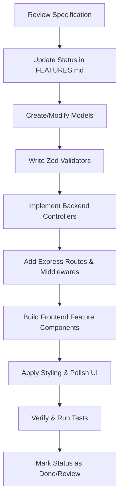

# SkillKart Development Workflow Guide

Welcome to the **SkillKart Development Workflow Guide**. This document outlines the standards, procedures, and architectural practices for developing features on the SkillKart Learning Management System (LMS).

## 🚀 1. Developer Setup & Environment
Ensure you have the required prerequisites:
- **Node.js** (v18+ recommended)
- **MongoDB** (local server running or a cloud URI)

### Local Startup
To launch the backend and frontend services:

#### Backend
1. Navigate to the backend directory:
   ```bash
   cd backend
   ```
2. Install dependencies:
   ```bash
   npm install
   ```
3. Create a `.env` file (if not present) with:
   ```env
   PORT=5000
   MONGO_URI=your_mongodb_connection_uri
   JWT_SECRET=your_jwt_secret
   CLIENT_URL=http://localhost:5173
   ```
4. Run in development mode:
   ```bash
   npm run dev
   ```
   *The server starts on port `5000` via tsx/nodemon.*

#### Frontend
1. Navigate to the frontend directory:
   ```bash
   cd frontend
   ```
2. Install dependencies:
   ```bash
   npm install
   ```
3. Run in development mode:
   ```bash
   npm run dev
   ```
   *The React app starts on [http://localhost:5173](http://localhost:5173).*

---

## 🛠️ 2. Core Architectural Patterns

### Backend (Express + TypeScript)
We enforce a strict separation of concerns located under [backend/src](file:///c:/Users/user/projects/skillkart/backend/src):
- **Models** (`src/models/`): Mongoose schemas defining MongoDB structures.
- **Validators** (`src/validators/`): Input validation using **Zod**. Every request body or query parameter should be validated here before hitting the controller.
- **Controllers** (`src/controllers/`): Extract parameters, trigger business actions, and send response JSONs.
- **Routes** (`src/routes/`): Define endpoints, assign routers, and bind authentication / validation middlewares.
- **Middlewares** (`src/middleware/`): Auth parsing (`authMiddleware`), admin/instructor checks, and validation handlers.

### Frontend (React + Vite + TailwindCSS v4)
We employ a feature-based folder structure located under [frontend/src](file:///c:/Users/user/projects/skillkart/frontend/src):
- **Features** (`src/features/`): Co-locates related files (components, page views, hooks) under domain folders:
  - `auth/` - Authentication flows
  - `student/` - Student learning board and dashboard
  - `instructor/` - Course creation, lesson, and section CRUD
  - `admin/` - Platform administration
  - `enrollment/` - Subscription and tracking
- **Shared Components** (`src/components/`): Reusable buttons, forms, layouts, and notification widgets.
- **Styles** (`src/styles/`): Main Tailwind configurations, animations, and Sass definitions for high-end aesthetics.

---

## 🔄 3. Feature Development Process
When developing a new feature or solving an issue, follow this systematic flow:



### Step 1: Spec Review & Status Update
1. Open the matching specification file in `docs/features/mvp/` (e.g. [14-certificates.md](file:///c:/Users/user/projects/skillkart/docs/features/mvp/14-certificates.md)).
2. Mark the status as `In Progress` in [FEATURES.md](file:///c:/Users/user/projects/skillkart/docs/FEATURES.md).

### Step 2: Database Modeling
Create or update your Mongoose schema in `backend/src/models/`. Keep these standards:
- Always use `{ timestamps: true }`.
- Create compound/single indexes on foreign identifiers (e.g., `userId`, `courseId`, `sectionId`) to guarantee quick lookups.
- Example: Compound unique index on student and course for certificates.

### Step 3: Input Validation (Zod)
Define strong TypeScript-friendly validation schemas inside `backend/src/validators/`.
- Validate user input fields, lengths, formats, and formats of ObjectIds.

### Step 4: Controllers & Routes
- Code the business action inside `src/controllers/`. Keep logic modular.
- Add the route to `src/routes/`. Apply the `authMiddleware` to protect sensitive endpoints.

### Step 5: Frontend Feature Components
- Place the components inside `frontend/src/features/<feature_name>/components/` or pages in `pages/`.
- Consume backend APIs using the shared Axios instance.
- Ensure premium design choices (glassmorphic overlays, vibrant gradients, custom fonts, smooth micro-animations).

### Step 6: Testing & Completion
- Manually run flows and check edge cases (auth failures, empty lists, unauthorized access).
- Update the documentation status in [FEATURES.md](file:///c:/Users/user/projects/skillkart/docs/FEATURES.md) to `Review` or `Done`.

---

## ⚡ 4. Special Subsystem Implementations

### Certificates System
*Guideline:* Refer to [.agents/skills/skillkart-certificates/SKILL.md](file:///c:/Users/user/projects/skillkart/.agents/skills/skillkart-certificates/SKILL.md).
- Certificates must auto-generate as soon as course progress hits 100%.
- Ensure a single, unique `certificateId` is generated using a 16-character alphanumeric sequence.
- Include a verification route on both the backend (`/api/certificates/verify/:certificateId`) and frontend (`/certificates/verify/:certificateId`).

### Notifications System
*Guideline:* Refer to [.agents/skills/skillkart-notifications/SKILL.md](file:///c:/Users/user/projects/skillkart/.agents/skills/skillkart-notifications/SKILL.md).
- Use the `Notification` model to prompt users asynchronously.
- Always handle Notification creations within a try-catch to ensure main transactions do not fail if notification creation hits an issue.
- Maintain notification types strictly: `info`, `success`, `warning`.

---

## 🏷️ 5. Git & Commit Guidelines
Keep your version history clean:
- **Branch Naming**:
  - New features: `feat/feature-name`
  - Bug fixes: `fix/bug-description`
  - Docs: `docs/documentation-topic`
- **Commit Style**: Use semantic prefixes:
  - `feat: implement course progress bar`
  - `fix: correct token expiry redirect`
  - `docs: add development workflow guide`
